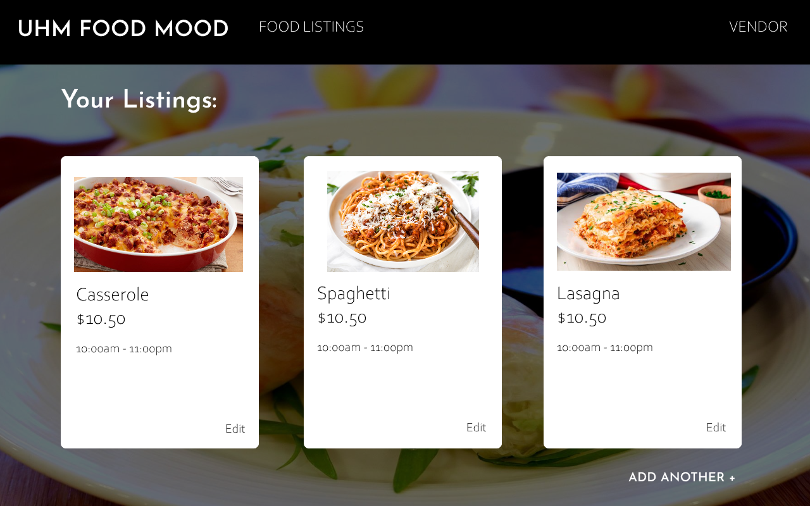
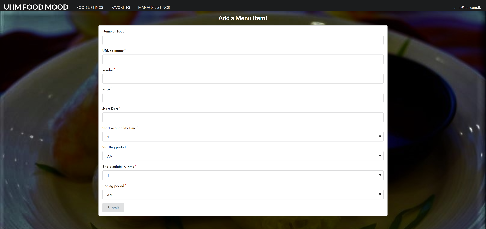

## Welcome to UHM Food Mood

UHM Food Mood is the solution to the ever-growing number of meal choices at UH Manoa. Once you log into your UHM Food Mood app, you can learn what menu items are available today and keep track of which of your food favorites are available today.

See our GitHub Organization <a href = "https://github.com/uhm-food-mood">here</a> and our deployed app on Galaxy <a href = "http://uhmfoodmood.meteorapp.com/#/">here</a>. 

In addition, see our M1 Project page <a href = "https://github.com/orgs/uhm-food-mood/projects/1">here</a> and our M2 Project page <a href = "https://github.com/orgs/uhm-food-mood/projects/2">here</a>.

### Goals

The main goals of UHM Food Mood are to:
- Provide a consolidated directory of UHM menu items from UHM Food Vendors and Manoa Dining Services
- Give students a way to easily find their favorite foods on campus
- Give students food suggestions that they might like on campus

### What this app will provide

Ultimately, we hope that the app will provide the following:
- Users will be able to log in and find their favorite foods on campus
- Vendors will be able to change menu items depending on their weekly/daily menu

###Overview

UHM Food Mood aims to provide a consolidated catalog of food options at UH Manoa. Although there are existing catalogs of food options on campus, such as <a href = "http://manoa.hawaii.edu/food/">UHM Food Vendors</a> and <a href = "https://uhm.sodexomyway.com/">Manoa Dining Services</a>, there are no catalogs that contain every food option on campus. We aim to make UHM Food Mood the website you look to for food options whenever you're hungry on campus. Eventually, we would like to give users the ability to rate food options so other students will know what's popular on campus.

###User Guide

Here is a guide through our existing mockup pages on our deployed website.

####Landing page:


The Landing page is the homepage for all users. It has a summary of the purpose of UHM Food Mood and a section that shows what student's "top picks", or most highly rated food options are. Currently, the top picks are just static data, as we have not implemented the review system yet. Click Login at the top right corner to log into your existing account or to create a new account.

See the Landing page <a href = "http://uhmfoodmood.meteorapp.com/#/">here</a>.

####User Favorites Page:


As a regular user, you can favorite your favorite foods from the Food Listing page (not yet implemented). These favorited foods will appear in your Favorites page. We have not implemented the ability to add or remove favorites yet, so the data displayed in the john@foo.com account is just test data. In the future, we will also implement the ability to search through your favorites based on keywords (name of food, type of food, vegan, etc). In addition, we will ensure that the foods that are available right now will appear at the top of your favorites.

See the Favorites page <a href = "http://uhmfoodmood.meteorapp.com/#/list">here</a>

####Vendor Listing Page:


As a vendor, you can add new listings and edit your existing listings. Your listings will all be shown in the Vendor Listings page. To add a new listing, you will need to click on the "Add Another" link at the bottom of the page. To edit an existing listing, click on the Edit link at the bottom left corner of the card containing the listing.

See the Vendor Listings page <a href = "http://uhmfoodmood.meteorapp.com/#/vendor">here</a>

####Vendor/Admin Add Listing Page:



As an admin/vendor, you can utilize the Add Listing Page to add new food listings. You will need to enter the name of the food, the name of the vendor, the price, the date when the food will be available from, and the times when students can purchase the food. Click the submit button and it will create a new listing with the provided information. Currently, the form itself is not working due to a form error, but we plan to fix this in the next implementation.

See the Vendor/Admin Add Listing Page <a href = "http://uhmfoodmood.meteorapp.com/#/add/">here</a>

####Admin Listings:


As an admin, you can edit, remove, and add new food listings. Admins can also view all food listings from all vendors. However, currently the edit and add food listing features have not been implemented. Along with those features, we will also be implementing the ability to search through these listings and view the listings in a more organized manner.

See the Admin Listings Page <a href = "http://uhmfoodmood.meteorapp.com/#/admin">here</a>

###Community Feedback

We have gotten a couple of students to review our prototype so far. Many students believe that a consolidated menu of all food options on campus would be a very helpful resource. 

A few possible improvements mentioned by these students are mainly regarding the User Interface, such as using lighter typefaces and varying the font size.

In the future, as we implement more functionality, we intend to carry out further tests with students - especially regarding the user interface and navigation.

###Developer Guide

####Installation
The first thing you will need to is install <a href="https://www.meteor.com/install">Meteor</a>. 

Next, download <a href="https://github.com/uhm-food-mood/uhm-food-mood">UHM Food Mood</a>. 

Then, cd into the app/ directory of your local copy of the repo and install third party libraries with:
```
meteor npm install
```
Once you've installed the libraries, run the application with the following command:
```
meteor npm run start
```
The first time you run the app, it will create some default users and data. This is the output:
```
C:\Users\Kelli\Documents\GitHub\uhm-food-mood\app>meteor npm run start

> meteor-application-template-react@ start C:\Users\Kelli\Documents\GitHub\uhm-food-mood\app
> meteor --no-release-check --settings ../config/settings.development.json

[[[[[ C:\Users\Kelli\Documents\GitHub\uhm-food-mood\app ]]]]]

=> Started proxy.
=> Started MongoDB.
W20191120-15:57:14.868(-10)? (STDERR) Note: you are using a pure-JavaScript implementation of bcrypt.
W20191120-15:57:14.923(-10)? (STDERR) While this implementation will work correctly, it is known to be
W20191120-15:57:14.936(-10)? (STDERR) approximately three times slower than the native implementation.
W20191120-15:57:14.941(-10)? (STDERR) In order to use the native implementation instead, run
W20191120-15:57:14.957(-10)? (STDERR)
W20191120-15:57:14.960(-10)? (STDERR)   meteor npm install --save bcrypt
W20191120-15:57:14.975(-10)? (STDERR)
W20191120-15:57:14.980(-10)? (STDERR) in the root directory of your application.
I20191120-15:57:15.188(-10)? Creating the default user(s)
I20191120-15:57:15.191(-10)?   Creating user admin@foo.com.
I20191120-15:57:15.571(-10)?   Creating user john@foo.com.
I20191120-15:57:15.779(-10)?   Creating user vendor@foo.com.
I20191120-15:57:15.997(-10)? Creating default data.
I20191120-15:57:16.001(-10)?   Adding: Basket (john@foo.com)
I20191120-15:57:16.014(-10)?   Adding: Bicycle (john@foo.com)
I20191120-15:57:16.017(-10)?   Adding: Banana (admin@foo.com)
I20191120-15:57:16.033(-10)?   Adding: Boogie Board (admin@foo.com)
I20191120-15:57:16.052(-10)? Creating default data.
I20191120-15:57:16.069(-10)?   Adding: Nachos (vendor@foo.com)
I20191120-15:57:16.078(-10)?   Adding: Enchiladas (vendor@foo.com)
I20191120-15:57:16.094(-10)?   Adding: Sushi (vendor@foo.com)
I20191120-15:57:16.099(-10)?   Adding: Chicken Sandwich (vendor@foo.com)
I20191120-15:57:16.115(-10)?   Adding: Nachos (vendor@foo.com)
I20191120-15:57:16.135(-10)?   Adding: Enchiladas (vendor@foo.com)
I20191120-15:57:16.152(-10)?   Adding: Sushi (vendor@foo.com)
I20191120-15:57:16.169(-10)?   Adding: Nachos (john@foo.com)
I20191120-15:57:16.186(-10)?   Adding: Enchiladas (john@foo.com)
I20191120-15:57:16.193(-10)?   Adding: Sushi (john@foo.com)
I20191120-15:57:16.194(-10)?   Adding: Chicken Sandwich (vendor@foo.com)
=> Started your app.

=> App running at: http://localhost:3000/
   Type Control-C twice to stop.
```
####Viewing UHM Food Mood
If the app was installed correctly, you will be able to view it at http://localhost:3000/. You can login using the credentials in <a href="https://github.com/uhm-food-mood/uhm-food-mood/blob/master/config/settings.development.json">settings.development.json</a>.
###Development History
####Milestone 1
In Milestone 1, we created the Landing page and four mockup pages - the User Favorites page, the Vendor Listings page, the Vendor/Admin Add Listing page, and the Admin Listings page. We added a small amount of functionality to the Admin Listings page, as admins are able to remove listings from the Admin Listings page. We also set up the schema for and MongoDB collection of food options (MenuItems Collection), so all of the information on the cards that appear on our app is pulled from our database.
####Milestone 2
For Milestone 2, we plan to greatly improve the user interface and  functionality of UHM Food Mood. Functionality-wise, we will implement working Add/Edit Listing and Food Listing pages, allow users to search through the food listings, and give users the ability to add favorite food listings. We will also update the UI, from fixing styling/padding errors to redesigning the layout of the cards to be more intuitive.
###Contact Us
The developers of this website are: Michael Johnson, Brandon Won, and Kelli Tamashiro. If you have any questions about our system, please feel free to contact us at kellikt@hawaii.edu.
