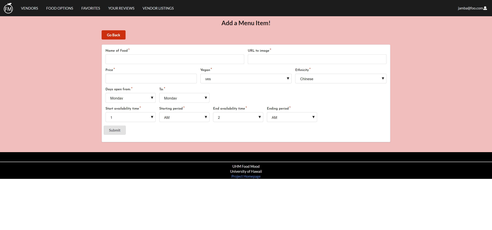

## Welcome to UHM Food Mood

UHM Food Mood is the solution to the ever-growing number of meal choices at UH Manoa. Once you log into your UHM Food Mood app, you can learn what menu items are available today and keep track of which of your food favorites are available today.

See our GitHub Organization <a href = "https://github.com/uhm-food-mood">here</a> and our deployed app on Galaxy <a href = "http://uhmfoodmood.meteorapp.com/#/">here</a>. Also see our GitHub repository for our UHM Food Mood website <a href = "https://github.com/uhm-food-mood/uhm-food-mood">here</a> and the GitHub repository for this website <a href = "https://github.com/uhm-food-mood/uhm-food-mood.github.io">here</a>.

In addition, see our M1 Project page <a href = "https://github.com/orgs/uhm-food-mood/projects/1">here</a>, our M2 Project page <a href = "https://github.com/orgs/uhm-food-mood/projects/2">here</a>, and our M3 Project page <a href = "https://github.com/orgs/uhm-food-mood/projects/3">here</a>.

### Goals

The main goals of UHM Food Mood are to:
- Provide a consolidated directory of UHM menu items from UHM Food Vendors and Manoa Dining Services
- Give students a way to easily find their favorite foods on campus
- Give students food suggestions that they might like on campus

### What this app will provide

Ultimately, we hope that the app will provide the following:
- Users will be able to log in and find their favorite foods on campus
- Vendors will be able to change menu items depending on their weekly/daily menu

### Overview

UHM Food Mood aims to provide a consolidated catalog of food options at UH Manoa. Although there are existing catalogs of food options on campus, such as <a href = "http://manoa.hawaii.edu/food/">UHM Food Vendors</a> and <a href = "https://uhm.sodexomyway.com/">Manoa Dining Services</a>, there are no catalogs that contain every food option on campus. We aim to make UHM Food Mood the website you look to for food options whenever you're hungry on campus. Eventually, we would like to give users the ability to rate food options so other students will know what's popular on campus.

### User Guide

Here is a guide through our existing mockup pages on our deployed website.

#### Landing page:


The Landing page is the homepage for all users. It has a summary of the purpose of UHM Food Mood and a section that shows what student's "top picks", or most highly rated food options are. This is based on the average of the ratings (score of 1 - 5, 5 being the highest) in the reviews of each food option. Click Login at the top right corner to log into your existing account or to create a new account.

See the Landing page <a href = "http://uhmfoodmood.meteorapp.com/#/">here</a>.

#### Food Options Page:

Without logging in, you can still view all the food options available. Each card shown displays the name, image, vendor, availability, style, and price of the food. There is also an option to "favorite" the food by clicking on the heart button, but you must be logged in for this function to work.

You can also use the search bar to search through the food options. Search by the name of the food:

Or by the style of the food:

Or by vendor:

Or if it's vegan:

Or even a mixture of both:


You can also see which food is available right now by clicking the "Food Available Now" button. When it is active, the button will turn green. If you want to show all food options available, just click the "Food Available Now" button again.


You can also sort the food options by the highest rated food options by clicking the "Sort by Rating" button. Like the "Food Available Now" button, when this button is active, it will turn green. If you want it to revert back to the unsorted order, just click the "Sort By Rating" button again.


In addition, you can have both buttons active at once, showing you the food options available right now, sorted by highest rating.


As a regular user (logged in user), you can favorite items from this page by clicking the heart button on the food option card. Once this button is clicked, the heart button will turn red, indicating that you have favorited this food option. You will also receive an alert confirming that you have added this item to your favorites.


See the Food Options Page <a href="http://uhmfoodmood.meteorapp.com/#/allListings">here</a>.

#### Reviews Page


In addition, each food option has a review page. You can view these reviews by clicking on the "See Reviews" link at the bottom of the food option card. Each review shows the username of the user who created the review, their rating (1 - 5, 5 being the highest) in stars, and their description for the review.

As a regular user (logged in), you can edit or remove your review if you have created a review for this food option.

 

See the Reviews Page of a food option (Eggplant Parmesan) here: <a href="http://uhmfoodmood.meteorapp.com/#/review/82bE4Z73wqSPRt5Td">here</a>.

#### Vendors Page


The Vendors page showcases all of our vendors, it displays their logo, name, and a short description of what they are. Like the Food Options page, you do not need to be logged in to view this page.

You can click the "See their food options" button to view all their food options.


It has the same search and sorting functionality as the Food Options page, so you can search by name, vendor, style, whether it's vegan. You can also use the "Food Available Now" and "Sort by rating" buttons to view food that's available now or to sort the food options by rating.

See the Food Listings page <a href="http://uhmfoodmood.meteorapp.com/#/listings">here</a>.

#### User Favorites Page:


As a regular user, you can favorite your favorite foods from the Food Options. These favorited foods will appear in your Favorites page. If you want to delete any of your favorites, you just need to click on the "Remove" button at the bottom left of the card. Like the Food Options page, you have the same search functionality using the search bar at the top left.

Before removing a favorite, a user will be sent an alert to confirm that they want to remove the favorite.


Once confirmed, they will receive an alert that the removal was successful.


See the Favorites page (must be logged in) <a href = "http://uhmfoodmood.meteorapp.com/#/list">here</a>

####Your Reviews Page


Regular (logged in) users can also manage their reviews by going to the Your Reviews page. It lists the name of the food they reviewed, the vendor the food is from, the rating they gave the food, and the description associated with the review. They also have the ability to edit or delete reviews.

If they delete a review, they will first be asked to confirm the deletion:

Once confirmed, they will receive an alert letting them know their review has been deleted:


See Your Reviews page <a href="http://uhmfoodmood.meteorapp.com/#/reviews">here</a>.

#### Vendor Listing Page:


As a vendor, you can add new listings and edit or delete your existing listings. Your listings will all be shown in the Vendor Listings page. To add a new listing, you will need to click on the "Add Menu Item" button at the top right of the page. To edit an existing listing, click on the Edit link in the row containing the listing. To delete a listing, click the trash can button in the row containing the listing. You also have the same search functionality for your own listings, using the search bar at the top left corner.

See the Vendor Listings page <a href = "http://uhmfoodmood.meteorapp.com/#/vendor">here</a>

#### Vendor/Admin Add Listing Page:



As an admin/vendor, you can utilize the Add Listing Page to add new food listings. You will need to enter the name of the food, the URL to the image of the food, the name of the vendor, the price, whether the food is vegan, the style of the food, the date when the food will be available from, and the times when students can purchase the food. Click the submit button and it will create a new listing with the provided information. 


See the Vendor/Admin Add Listing Page <a href = "http://uhmfoodmood.meteorapp.com/#/add/">here</a>

#### Vendor/Admin Edit Listing Page:


As an admin/vendor, you are also given the ability to use the Edit Listing Page to edit food listings. All the previous information about the food listing is already filled in, all you need to do is edit the parts that you would like to change. Once you have finished making your changes, click submit.


If you have received this notification, you have successfully edited the menu item.

See an example of a Vendor/Admin Edit Listing Page (each menu item has a unique URL for their edit page) <a href="http://uhmfoodmood.meteorapp.com/#/edit/4u9kNpbJJNCn4PBKE">here</a>.

#### Admin - Manage Listings Page


As an admin, you can edit, remove, and add new food listings. Admins can also view all food listings from all vendors. In addition, you can search through all these listings using the search bar at the top left corner.

See the Manage Listings Page <a href = "http://uhmfoodmood.meteorapp.com/#/admin">here</a>

Note that to get to this page as an admin, you will need to click on Manage > Manage Listings in the menu.

#### Admin - Manage Favorites Page


As an Admin, you can also view and delete favorites of all users. The Manage Favorites page displays the owner, food name, and vendor of the favorite. You can also search through all the favorites by using the search bar at the top left corner (owner, food name, or vendor work). In addition, admins can delete a favorite from a user by clicking on the red trash can icon in the Remove column.

See the Manage Favorites Page <a href = "http://uhmfoodmood.meteorapp.com/#/listFavorites">here</a>.

#### Admin - Manage Users Page


Additionally, Admins can also view and manage all users in the Manage Users page. Admins can search through users using the search bar at the top left corner (search by name). Admins can also add users as admins or vendors by clicking on the red "Add as Admin" button or the red "Add as Vendor" button. They can also remove users by clicking on the red trash can icon in the Remove column.

See the Manage Users Page <a href = "http://uhmfoodmood.meteorapp.com/#/users">here</a>.

### Community Feedback

We have gotten a couple of students to review our prototype so far. Many students believe that a consolidated menu of all food options on campus would be a very helpful resource. 

A few possible improvements mentioned by these students are mainly regarding the User Interface, such as using lighter typefaces and varying the font size.

In the future, as we implement more functionality, we intend to carry out further tests with students - especially regarding the user interface and navigation.

### Developer Guide

#### Installation
The first thing you will need to is install <a href="https://www.meteor.com/install">Meteor</a>. 

Next, download <a href="https://github.com/uhm-food-mood/uhm-food-mood">UHM Food Mood</a>. 

Then, cd into the app/ directory of your local copy of the repo and install third party libraries with:
```
meteor npm install
```
You will also need to install Moment using:
```
npm install moment
```
Once you've installed the libraries, run the application with the following command:
```
meteor npm run start
```
The first time you run the app, it will create some default users and data. This is the output:
```
C:\Users\Kelli\Documents\GitHub\uhm-food-mood\app>meteor npm run start

> meteor-application-template-react@ start C:\Users\Kelli\Documents\GitHub\uhm-food-mood\app
> meteor --no-release-check --settings ../config/settings.development.json

[[[[[ C:\Users\Kelli\Documents\GitHub\uhm-food-mood\app ]]]]]

=> Started proxy.
=> Started MongoDB.
W20191203-20:28:53.339(-10)? (STDERR) Note: you are using a pure-JavaScript implementation of bcrypt.
W20191203-20:28:53.413(-10)? (STDERR) While this implementation will work correctly, it is known to be
W20191203-20:28:53.414(-10)? (STDERR) approximately three times slower than the native implementation.
W20191203-20:28:53.428(-10)? (STDERR) In order to use the native implementation instead, run
W20191203-20:28:53.432(-10)? (STDERR)
W20191203-20:28:53.445(-10)? (STDERR)   meteor npm install --save bcrypt
W20191203-20:28:53.449(-10)? (STDERR)
W20191203-20:28:53.462(-10)? (STDERR) in the root directory of your application.
I20191203-20:28:53.978(-10)? Creating the default user(s)
I20191203-20:28:53.983(-10)?   Creating user admin@foo.com.
I20191203-20:28:54.310(-10)?   Creating user john@foo.com.
I20191203-20:28:54.636(-10)?   Creating user vendor@foo.com.
I20191203-20:28:55.170(-10)? Creating default data.
I20191203-20:28:55.180(-10)?   Adding: Eggplant Parmesan (vendor@foo.com)
I20191203-20:28:55.203(-10)?   Adding: Moussakka (vendor@foo.com)
I20191203-20:28:55.212(-10)?   Adding: Thai Green Vegetable Curry (vendor@foo.com)
I20191203-20:28:55.229(-10)?   Adding: Thai Red Vegetable Curry (vendor@foo.com)
I20191203-20:28:55.234(-10)?   Adding: Lamb/Beef/Chicken Wrap (vendor@foo.com)
I20191203-20:28:55.254(-10)?   Adding: Lamb/Beef/Chicken Plate (vendor@foo.com)
I20191203-20:28:55.260(-10)?   Adding: Lamb/Beef/Chicken Salad (vendor@foo.com)
I20191203-20:28:55.281(-10)?   Adding: Garlic Yogurt Sauce (vendor@foo.com)
I20191203-20:28:55.286(-10)?   Adding: Coffee (Hot/Cold/Blended) (vendor@foo.com)
I20191203-20:28:55.290(-10)?   Adding: Donuts (vendor@foo.com)
I20191203-20:28:55.341(-10)?   Adding: Lunch Sandwiches (vendor@foo.com)
I20191203-20:28:55.342(-10)?   Adding: Breakfast (vendor@foo.com)
I20191203-20:28:55.344(-10)?   Adding: Khichdi (vendor@foo.com)
I20191203-20:28:55.345(-10)?   Adding: Strawberry Halava (vendor@foo.com)
I20191203-20:28:55.346(-10)?   Adding: Peanut Butter Halava (vendor@foo.com)
I20191203-20:28:55.348(-10)?   Adding: Pineapple Coconut Halava (vendor@foo.com)
I20191203-20:28:55.349(-10)?   Adding: Tuna Melt Panini (vendor@foo.com)
I20191203-20:28:55.380(-10)?   Adding: Grilled Cheese Panini (vendor@foo.com)
I20191203-20:28:55.384(-10)?   Adding: Chicken Chipotle Panini (vendor@foo.com)
I20191203-20:28:55.406(-10)?   Adding: Turkey Avocado Panini (vendor@foo.com)
I20191203-20:28:55.411(-10)?   Adding: Corn Tacos (vendor@foo.com)
I20191203-20:28:55.432(-10)?   Adding: Burritos (vendor@foo.com)
I20191203-20:28:55.464(-10)?   Adding: Quesadillas (vendor@foo.com)
I20191203-20:28:55.468(-10)?   Adding: Tamales (vendor@foo.com)
I20191203-20:28:55.488(-10)?   Adding: Shave Ice (vendor@foo.com)
I20191203-20:28:55.493(-10)?   Adding: Sorbet Bowls (vendor@foo.com)
I20191203-20:28:55.517(-10)?   Adding: Poke Nachos (vendor@foo.com)
I20191203-20:28:55.517(-10)?   Adding: Acai Bowls (vendor@foo.com)
I20191203-20:28:55.539(-10)?   Adding: Beefy Miso Ramen (vendor@foo.com)
I20191203-20:28:55.544(-10)?   Adding: Beefy Spicy Ramen (vendor@foo.com)
I20191203-20:28:55.565(-10)?   Adding: Beefy Wild Ramen (vendor@foo.com)
I20191203-20:28:55.568(-10)?   Adding: Pork Gyoza (vendor@foo.com)
I20191203-20:28:55.589(-10)?   Adding: Chicken Katsu (vendor@foo.com)
I20191203-20:28:55.594(-10)?   Adding: Loco Moco (vendor@foo.com)
I20191203-20:28:55.613(-10)?   Adding: BBQ Chicken (vendor@foo.com)
I20191203-20:28:55.618(-10)?   Adding: Grilled Garlic Ahi (vendor@foo.com)
I20191203-20:28:55.640(-10)?   Adding: Egg Masala (vendor@foo.com)
I20191203-20:28:55.644(-10)?   Adding: Vegetable Masala (vendor@foo.com)
I20191203-20:28:55.664(-10)?   Adding: Tofu Sambal (vendor@foo.com)
I20191203-20:28:55.811(-10)?   Adding: Vegetable Sambal (vendor@foo.com)
I20191203-20:28:55.816(-10)?   Adding: Cheese Louise (vendor@foo.com)
I20191203-20:28:55.837(-10)?   Adding: Pesto- Pesto (vendor@foo.com)
I20191203-20:28:55.842(-10)?   Adding: Nutella (vendor@foo.com)
I20191203-20:28:55.864(-10)?   Adding: Shoyu Ahi Poke Bowl (vendor@foo.com)
I20191203-20:28:55.868(-10)?   Adding: Shoyu Tako Poke Bowl (vendor@foo.com)
I20191203-20:28:55.890(-10)?   Adding: Miso Ahi Poke Bowl (vendor@foo.com)
I20191203-20:28:55.896(-10)?   Adding: Miso Tako Poke Bowl (vendor@foo.com)
I20191203-20:28:55.917(-10)?   Adding: Orange Chicken (vendor@foo.com)
I20191203-20:28:55.941(-10)?   Adding: Beef Broccoli (vendor@foo.com)
I20191203-20:28:55.946(-10)?   Adding: Mushroom Chicken (vendor@foo.com)
I20191203-20:28:55.967(-10)?   Adding: Honey Walnut Shrimp (vendor@foo.com)
I20191203-20:28:55.991(-10)?   Adding: Black/Green Iced Tea (vendor@foo.com)
I20191203-20:28:55.995(-10)?   Adding: Hot Cocoa (vendor@foo.com)
I20191203-20:28:56.017(-10)?   Adding: Cold Cereal w/Fruit (vendor@foo.com)
I20191203-20:28:56.052(-10)?   Adding: Ice Cream Sundae (vendor@foo.com)
I20191203-20:28:56.057(-10)?   Adding: Fish Jun Plate (vendor@foo.com)
I20191203-20:28:56.091(-10)?   Adding: Kalbi Bibimbap (vendor@foo.com)
I20191203-20:28:56.116(-10)?   Adding: Steak Plate (vendor@foo.com)
I20191203-20:28:56.141(-10)?   Adding: Homemade Kimchi (vendor@foo.com)
I20191203-20:28:56.145(-10)?   Adding: Cappuccino (vendor@foo.com)
I20191203-20:28:56.145(-10)?   Adding: Macchiato (vendor@foo.com)
I20191203-20:28:56.176(-10)?   Adding: Latte (vendor@foo.com)
I20191203-20:28:56.179(-10)?   Adding: Mocha (vendor@foo.com)
I20191203-20:28:56.201(-10)?   Adding: Pho (vendor@foo.com)
I20191203-20:28:56.226(-10)?   Adding: Pad Thai (vendor@foo.com)
I20191203-20:28:56.230(-10)?   Adding: Banh Mi Sandwiches (vendor@foo.com)
I20191203-20:28:56.251(-10)?   Adding: Spring Rolls (vendor@foo.com)
I20191203-20:28:56.274(-10)?   Adding: Smoothies (vendor@foo.com)
I20191203-20:28:56.278(-10)?   Adding: Oatmeal Bowl (vendor@foo.com)
I20191203-20:28:56.278(-10)?   Adding: Apple Cinnamon Pretzel (vendor@foo.com)
I20191203-20:28:56.304(-10)?   Adding: Banana Toast (vendor@foo.com)
I20191203-20:28:56.324(-10)? Creating default reviews.
I20191203-20:28:56.328(-10)?   Adding Review: Nachos (john@foo.com)
=> Started your app.

=> App running at: http://localhost:3000/
   Type Control-C twice to stop.
```
#### Viewing UHM Food Mood
If the app was installed correctly, you will be able to view it at http://localhost:3000/. You can login using the credentials in <a href="https://github.com/uhm-food-mood/uhm-food-mood/blob/master/config/settings.development.json">settings.development.json</a>.
### Development History
#### Milestone 1
In Milestone 1, we created the Landing page and four mockup pages - the User Favorites page, the Vendor Listings page, the Vendor/Admin Add Listing page, and the Admin Listings page. We added a small amount of functionality to the Admin Listings page, as admins are able to remove listings from the Admin Listings page. We also set up the schema for and MongoDB collection of food options (MenuItems Collection), so all of the information on the cards that appear on our app is pulled from our database.
#### Milestone 2
For Milestone 2, we greatly improved the functionality of our website. All users can search through the Food Options page by name, vendor, style of food, or even whether a food is vegan. Regular users are now able to use the "favorite" function so that the foods they favorite will show up in their "Favorites" page. Vendors are able to add new listings and edit/remove existing listings that they own. Admins possess the same abilities of vendors, but are able to use these abilities on all listings, including ones they do not own. We also added an immense amount of default data, 72 menu items - 4 sample food items from 18 vendors. In addition, we set up the Review collection to prepare for the addition of Reviews in Milestone 3.
#### Milestone 3
For Milestone 3, we intend to improve upon the functionality we provided in Milestone 2. We will add functionality to the Reviews collection, so that users will be able to add reviews to their menu items. We will also add a page (or sort the existing search page) to see all a menu items that are available right now. Adding to that, we will improve upon the availability function, as currently it shows that an item is available regardless of day, as long as it is within the hours it is available. We will also make significant updates to the UI, changing the color scheme (testers noted that the background was at times, overwhelming) and improving the interface of specific pages, like the Food Listings and Sign in/Register pages. More issues are expected to come up as we go through with user testing next week.


### Contact Us
The developers of this website are: Michael Johnson, Brandon Won, and Kelli Tamashiro. If you have any questions about our system, please feel free to contact us at kellikt@hawaii.edu.
