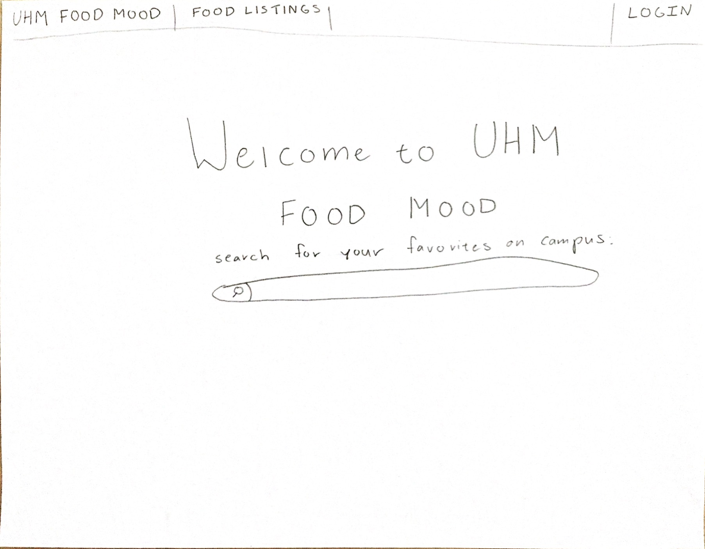

## Welcome to UHM Food Mood

UHM Food Mood is the solution to the ever-growing number of meal choices at UH Manoa. Once you log into your UHM Food Mood app, you can learn what menu items are available today and keep track of which of your food favorites are available today.

### Goals

The main goals of UHM Food Mood are to:
- Provide a consolidated directory of UHM menu items from UHM Food Vendors and Manoa Dining Services
- Give students a way to easily find their favorite foods on campus
- Give students food suggestions that they might like on campus

### What this app will provide

Ultimately, we hope that the app will provide the following:
- Users will be able to log in and find their favorite foods on campus
- Vendors will be able to change menu items depending on their weekly/daily menu

### Mockup Pages

Landing page:

